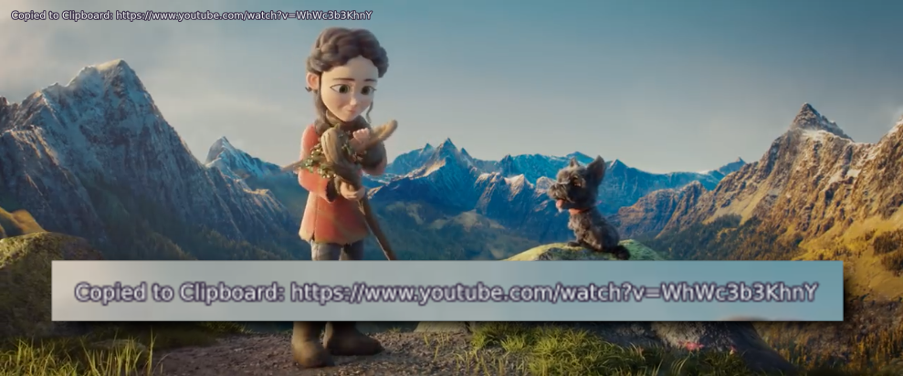

# 🎬📋 MPV CopyPath with XClip

Get the current video path to clipboard.

By default, the script is bind to <kbd><b>y</b></kbd> <kbd><b>p</b></kbd>

This script only run with Linux/BSD with XClip.


## 📦 Install

Just copy `copy-path-xclip.lua` to your `~/.config/mpv/scripts/` directory.

```
~/.config/mpv/..
📂 scripts
└ 📄 copy-path-xclip.lua
📄 input.conf
📄 mpv.conf
```


## 🍲 Usage

Just press **y** then **p** (in sequence), it will get and copy video path/url to your clipboard.

Output is plain string, without "\n" (Line Feed), like this:

```
https://www.youtube.com/watch?v=WhWc3b3KhnY
```


## 🖼️ Screenshot




## 🤝 Credit

I pretty much copied the [mpv-copyTime](https://github.com/Arieleg/mpv-copyTime) script.
